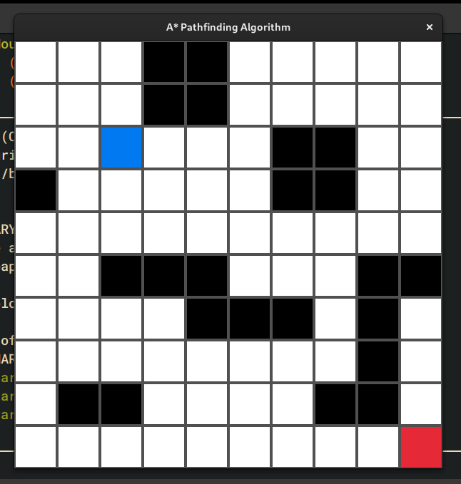

# 🧭 A* Algorithm in C

An implementation of [A* algorithm](https://en.wikipedia.org/wiki/A*_search_algorithm) in C. The
implementation is not efficient, as it iterates through all nodes to find the one with lowest
f-cost and uses linked lists as well. The code comes with a simple demo in raylib.



## 🛠️ Build

The demo build depends on raylib.
```bash
chmod +x build.sh
./build.sh # this will also run the code
```

## 🧩 Usage

To use the code simply copy `src/a_star.h` and `src/a_star.c` in your project and
include the header where appropriate.
